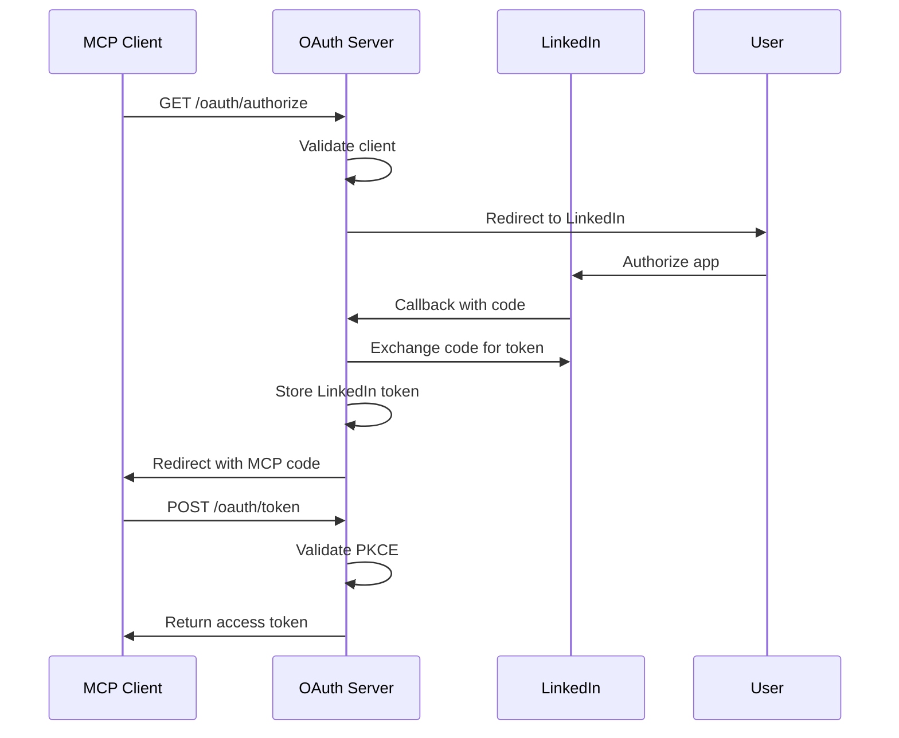

# OAuth Integration Guide

The LinkedIn MCP Server supports OAuth 2.1 authentication, allowing MCP clients to authorize with LinkedIn and publish posts on behalf of users.

## Overview

When OAuth is enabled, the server acts as an OAuth authorization server that:
1. Authenticates MCP clients
2. Redirects users to LinkedIn for authorization
3. Exchanges LinkedIn tokens for MCP access tokens
4. Validates requests and auto-refreshes expired LinkedIn tokens

## Quick Start

### 1. Create a LinkedIn App

1. Go to [LinkedIn Developers](https://www.linkedin.com/developers/apps)
2. Click "Create app"
3. Fill in app details:
   - App name: Your MCP Server
   - LinkedIn Page: Your company page
   - App logo: Upload a logo
4. Click "Create app"

### 2. Configure OAuth Settings

1. Go to the "Auth" tab
2. Add OAuth 2.0 redirect URL:
   ```
   http://localhost:8000/oauth/callback
   ```
3. Request these OAuth 2.0 scopes:
   - `openid` - Required for user identification
   - `profile` - User profile information
   - `w_member_social` - Post to LinkedIn on behalf of users
   - `email` - User email (optional)

4. Note your credentials:
   - Client ID
   - Client Secret

### 3. Configure Environment Variables

Create a `.env` file or export these variables:

```bash
# Required - LinkedIn OAuth credentials
export LINKEDIN_CLIENT_ID="your_linkedin_client_id"
export LINKEDIN_CLIENT_SECRET="your_linkedin_client_secret"

# Required for Development - Use in-memory session storage (no Redis needed)
export SESSION_PROVIDER=memory

# Optional - Override defaults
export LINKEDIN_REDIRECT_URI="http://localhost:8000/oauth/callback"
export OAUTH_SERVER_URL="http://localhost:8000"
export OAUTH_ENABLED="true"
```

### 4. Start the Server

```bash
# Install dependencies
uv sync

# Run in HTTP mode with OAuth
uv run linkedin-mcp http --port 8000
```

You should see:
```
✓ OAuth enabled - MCP clients can authorize with LinkedIn
  OAuth server: http://localhost:8000
  Discovery: http://localhost:8000/.well-known/oauth-authorization-server
```

## Testing with MCP-CLI

### Install MCP-CLI

```bash
pip install mcp-cli
```

### Configure MCP-CLI

Create `~/.mcp/servers.json`:

```json
{
  "linkedin": {
    "url": "http://localhost:8000/mcp",
    "transport": "sse",
    "oauth": {
      "enabled": true,
      "discovery_url": "http://localhost:8000/.well-known/oauth-authorization-server"
    }
  }
}
```

### Test OAuth Flow

```bash
# Start interactive session - will trigger OAuth flow
uv run mcp-cli --server linkedin --provider openai --model gpt-4

# You'll see:
# 🔐 Authentication required for linkedin
# 🔍 Discovering authorization server...
# 📝 Registering OAuth client...
# 🔐 Opening browser for authorization...
```

The OAuth flow will:
1. Open your browser to authorize with LinkedIn
2. Redirect to LinkedIn login/authorization page
3. After authorization, redirect back to the MCP server
4. Exchange tokens and complete authentication
5. Return to the CLI with access to all LinkedIn tools

### List Available Tools

Once authenticated:

```bash
> /tools

43 Available Tools
- linkedin_create
- linkedin_publish
- linkedin_add_hook
...
```

## OAuth Flow Details

### Authorization Flow



### Token Management

The server manages two layers of tokens:

1. **LinkedIn Tokens** (stored server-side)
   - LinkedIn access token
   - LinkedIn refresh token
   - Auto-refreshed when expired
   - TTL: 60 days

2. **MCP Tokens** (used by clients)
   - MCP access token
   - MCP refresh token
   - Short-lived (1 hour)
   - Refresh with refresh token

## Configuration Options

### Environment Variables

| Variable | Default | Description |
|----------|---------|-------------|
| `LINKEDIN_CLIENT_ID` | - | LinkedIn app client ID (required) |
| `LINKEDIN_CLIENT_SECRET` | - | LinkedIn app client secret (required) |
| `LINKEDIN_REDIRECT_URI` | `http://localhost:8000/oauth/callback` | OAuth callback URL |
| `OAUTH_SERVER_URL` | `http://localhost:8000` | OAuth server base URL |
| `OAUTH_ENABLED` | `true` | Enable/disable OAuth |

### Token TTL Configuration

All OAuth token expiration times can be customized via environment variables (values in seconds):

| Variable | Default | Description |
|----------|---------|-------------|
| `OAUTH_AUTH_CODE_TTL` | `600` | **Authorization codes** - Temporary codes exchanged for access tokens during OAuth flow. Short-lived for security (10 minutes). |
| `OAUTH_ACCESS_TOKEN_TTL` | `3600` | **Access tokens** - Used by MCP clients to authenticate API requests. Should be short-lived and refreshed regularly (1 hour). |
| `OAUTH_REFRESH_TOKEN_TTL` | `2592000` | **Refresh tokens** - Long-lived tokens that obtain new access tokens without re-authentication. Reduces user interruption (30 days). |
| `OAUTH_CLIENT_REGISTRATION_TTL` | `31536000` | **Client registrations** - How long dynamically registered MCP clients remain valid (1 year). |
| `OAUTH_EXTERNAL_TOKEN_TTL` | `5184000` | **LinkedIn tokens** - Access and refresh tokens from LinkedIn stored server-side. Auto-refreshed when expired (60 days, LinkedIn's default). |

Example configuration for shorter token lifetimes:

```bash
# 5 minute authorization codes
export OAUTH_AUTH_CODE_TTL=300

# 30 minute access tokens
export OAUTH_ACCESS_TOKEN_TTL=1800

# 7 day refresh tokens
export OAUTH_REFRESH_TOKEN_TTL=604800

# 7 day LinkedIn tokens
export OAUTH_EXTERNAL_TOKEN_TTL=604800
```

### Session Storage Configuration

The OAuth implementation uses [chuk-sessions](https://github.com/chrishayuk/chuk-sessions) for storing tokens and session data. You can configure the storage backend via environment variables:

**Development (Default)**: In-memory storage
```bash
# No configuration needed - defaults to memory
export SESSION_PROVIDER=memory  # Optional, this is the default
```

**Production**: Redis storage (recommended)
```bash
export SESSION_PROVIDER=redis
export SESSION_REDIS_URL=redis://your-redis-server:6379/0
```

**Session Provider Options:**
- `memory` - In-memory storage (default, no Redis required)
- `redis` - Redis storage (requires SESSION_REDIS_URL)

**Important**: Always use `SESSION_PROVIDER=memory` for local development to avoid needing a Redis instance. Only use Redis in production for scalability and persistence.

### Production Configuration

For production deployments:

```bash
# Required - LinkedIn OAuth credentials
export LINKEDIN_CLIENT_ID="your_production_linkedin_client_id"
export LINKEDIN_CLIENT_SECRET="your_production_linkedin_client_secret"

# Production URLs (HTTPS)
export OAUTH_SERVER_URL="https://your-domain.com"
export LINKEDIN_REDIRECT_URI="https://your-domain.com/oauth/callback"

# Redis for token storage (recommended for production)
export SESSION_PROVIDER=redis
export SESSION_REDIS_URL=redis://your-redis-server:6379/0

# Optional - Shorter token lifetimes for production security
export OAUTH_ACCESS_TOKEN_TTL=900        # 15 minutes
export OAUTH_REFRESH_TOKEN_TTL=86400     # 1 day
export OAUTH_EXTERNAL_TOKEN_TTL=86400    # 1 day
```

**Example: Deploy to https://linkedin.chukai.io**

```bash
# LinkedIn credentials
export LINKEDIN_CLIENT_ID="your_linkedin_app_client_id"
export LINKEDIN_CLIENT_SECRET="your_linkedin_app_client_secret"

# Production URLs
export OAUTH_SERVER_URL="https://linkedin.chukai.io"
export LINKEDIN_REDIRECT_URI="https://linkedin.chukai.io/oauth/callback"

# Redis for production
export SESSION_PROVIDER=redis
export SESSION_REDIS_URL="redis://your-redis.chukai.io:6379/0"

# Start server
uv run linkedin-mcp http --port 8000
```

**Important**: Update your LinkedIn app settings:
1. Go to [LinkedIn Developers](https://www.linkedin.com/developers/apps)
2. Select your app
3. Navigate to "Auth" tab
4. Add redirect URL: `https://linkedin.chukai.io/oauth/callback`
5. Save changes

## OAuth Endpoints

When OAuth is enabled, these endpoints are available:

### Discovery
```http
GET /.well-known/oauth-authorization-server
```

Returns OAuth server metadata for client discovery.

### Authorization
```http
GET /oauth/authorize?client_id={id}&redirect_uri={uri}&response_type=code&code_challenge={challenge}&code_challenge_method=S256&state={state}
```

Initiates OAuth flow. Redirects to LinkedIn for user authorization.

### Token Exchange
```http
POST /oauth/token
Content-Type: application/x-www-form-urlencoded

grant_type=authorization_code&code={code}&client_id={id}&redirect_uri={uri}&code_verifier={verifier}
```

Exchanges authorization code for access token with PKCE validation.

### Client Registration
```http
POST /oauth/register
Content-Type: application/json

{
  "client_name": "My MCP Client",
  "redirect_uris": ["http://localhost:8080/callback"]
}
```

Dynamically registers a new MCP client.

### LinkedIn Callback
```http
GET /oauth/callback?code={code}&state={state}
```

Internal endpoint for LinkedIn OAuth callback.

## Security Features

### PKCE (Proof Key for Code Exchange)

All OAuth flows use PKCE (RFC 7636) to prevent authorization code interception:

- **Code Challenge**: SHA256 hash of code verifier (base64url encoded)
- **Code Verifier**: Random 32-byte string
- **Challenge Method**: S256 (SHA256) or plain

The server validates that the code_verifier matches the code_challenge.

### Token Storage

Tokens are securely stored using [chuk-sessions](https://github.com/chrishayuk/chuk-sessions):

**Development**: In-memory storage (default)
```bash
# No configuration needed
uv run linkedin-mcp http
```

**Production**: Redis storage (recommended)
```bash
export SESSION_PROVIDER=redis
export SESSION_REDIS_URL=redis://your-redis:6379/0
uv run linkedin-mcp http
```

### Multi-Tenant Isolation

The server uses sandbox IDs to isolate tokens:
- Sandbox ID: `chuk-mcp-linkedin`
- All tokens prefixed: `chuk-mcp-linkedin:token_type:id`
- Prevents cross-tenant token access

## Troubleshooting

### OAuth Not Enabled

**Symptom**: Server starts without OAuth endpoints

**Solution**: Ensure environment variables are set:
```bash
echo $LINKEDIN_CLIENT_ID
echo $LINKEDIN_CLIENT_SECRET
```

If empty, OAuth is disabled. Set credentials and restart.

### Redirect URI Mismatch

**Symptom**: LinkedIn error: "The redirect_uri does not match the registered value"

**Solution**: Ensure redirect URI matches exactly:
1. In LinkedIn app settings: `http://localhost:8000/oauth/callback`
2. In environment: `LINKEDIN_REDIRECT_URI=http://localhost:8000/oauth/callback`
3. No trailing slashes, exact protocol (http/https)

### Token Exchange Fails

**Symptom**: `400 Bad Request` on token endpoint

**Common causes**:

1. **PKCE validation failed**
   - Ensure code_verifier matches code_challenge
   - Check challenge method (S256 vs plain)

2. **Redirect URI mismatch**
   - Must match exactly with authorization request

3. **Expired authorization code**
   - Codes expire after 10 minutes
   - Request new authorization

4. **Code already used**
   - Authorization codes are one-time use
   - Request new authorization

### LinkedIn Token Expired

**Symptom**: API calls fail with 401 Unauthorized

**Solution**: The server automatically refreshes expired LinkedIn tokens. If refresh fails:
1. User needs to re-authorize with LinkedIn
2. Delete old tokens and restart OAuth flow

## Advanced Usage

### Custom Token TTLs

Modify token lifetimes in your provider:

```python
# In oauth/provider.py

# Authorization codes (default: 10 minutes)
await session.setex(
    f"{self.sandbox_id}:auth_code:{code}",
    600,  # 10 minutes
    json.dumps(code_data),
)

# Access tokens (default: 1 hour)
await session.setex(
    f"{self.sandbox_id}:access_token:{access_token}",
    3600,  # 1 hour
    json.dumps(access_data),
)

# Refresh tokens (default: 30 days)
await session.setex(
    f"{self.sandbox_id}:refresh_token:{refresh_token}",
    30 * 24 * 3600,  # 30 days
    json.dumps(refresh_data),
)
```

### Testing Without LinkedIn

For development/testing without real LinkedIn credentials:

```python
# Create a mock provider
from chuk_mcp_server.oauth import BaseOAuthProvider

class MockLinkedInProvider(BaseOAuthProvider):
    async def authorize(self, params):
        # Skip LinkedIn, return mock code directly
        code = await self.token_store.create_authorization_code(
            user_id="test_user",
            client_id=params.client_id,
            redirect_uri=params.redirect_uri,
            scope=params.scope,
            code_challenge=params.code_challenge,
            code_challenge_method=params.code_challenge_method,
        )
        return {"code": code, "state": params.state}

    # Implement other required methods...
```

## Resources

- [LinkedIn OAuth Documentation](https://docs.microsoft.com/en-us/linkedin/shared/authentication/authentication)
- [OAuth 2.1 Specification](https://datatracker.ietf.org/doc/html/draft-ietf-oauth-v2-1)
- [PKCE RFC 7636](https://datatracker.ietf.org/doc/html/rfc7636)
- [chuk-mcp-server OAuth Guide](../../chuk-mcp-server/docs/OAUTH.md)
- [chuk-sessions Documentation](https://github.com/chrishayuk/chuk-sessions)

## Support

For issues or questions:
- GitHub Issues: [chuk-mcp-linkedin/issues](https://github.com/chrishayuk/chuk-mcp-linkedin/issues)
- Documentation: [docs/](../docs/)
